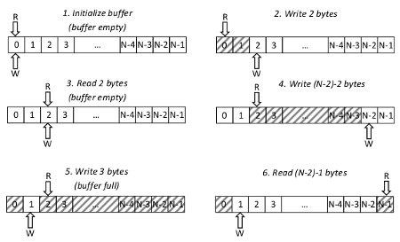

USBPcap capture buffer
----------------------

There is one capture buffer per Root Hub. Capture buffer uses the concept of circular buffer with overwrite protection. By default USBPcapCMD sets the buffer size to 1 MiB. Minimum buffer size is 4096 (4 KiB), maximum 134217728 (128 MiB).

Variables used in capture buffer implementation:

*   KSPIN\_LOCK _bufferLock_;  
    Used to synchronize the access to buffer.
*   PVOID _buffer_;  
    The actual buffer.
*   UINT32 _bufferSize_;  
    Size of buffer in bytes.
*   UINT32 _readOffset_;  
    Index of first unread byte.
*   UINT32 _writeOffset_;  
    Index of first empty byte that data can be written to.

Buffer is empty if and only if readOffset is equal to writeOffset. This condition is warranted by overwrite protection. The maximum number of bytes that can be stored inside buffer is bufferSize-1.

USBPcap (device) writes data into buffer. USBPcapCMD reads data from the buffer.

### USBPcap capture buffer working principle explained

Following symbols were used instead of full variable names:

*   **R** - _readOffset_
*   **W** - _writeOffset_
*   **N** - _bufferSize_

Both **R** and **W** can take values from range \[0, N-1\]. Buffer is empty if and only if **R=W** (**N-1** bytes of data can be written then). If **R<W** there are **N-R+W** unread bytes of data and it is possible to write **R-W-1** bytes of additional data. If **R>W** there are **W-R** unread bytes of data and it is possible to write **N-W-R-1** bytes of additional data.

  
Figure 1: USBPcap capture buffer working principle.

Sample 6-step buffer cycle is presented on figure 1. The steps are described below.

1.  Buffer initialization. Buffer of size **N** is being allocated and variables **R** and **W** are being zeroed.
2.  **2** bytes were written into the buffer **(R=0; W=2)**.
3.  **2** bytes were read from the buffer. The buffer is now empty **(R=W=2)**.
4.  **(N-2)-2** bytes of data were written **(R=2; W=N-2)**. Only 3 more bytes can be written into the buffer. Trying to write anything larger than 3 bytes will fail.
5.  **3** bytes were written into the buffer. The buffer is now full and no additional data can be written **(R=2; W=1)**.
6.  **(N-2)-1** bytes of data were read from the buffer **(R=N-1; W=1)**. Once again the data can be written into the buffer (maximum **N-3** bytes).
