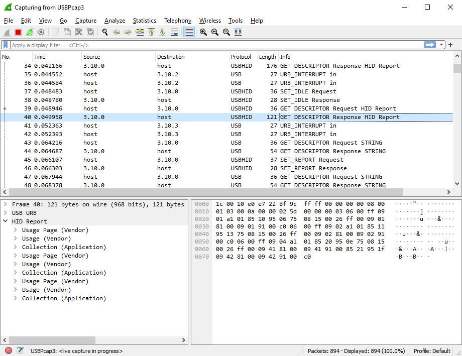

USBPcap - USB Packet capture for Windows
----------------------------------------

USBPcap is an open-source USB sniffer for Windows.

 [{: width="560"}](tour/extcap_live_capture.png "Screenshot")

Download
--------

Digitally signed installer for Windows 7, 8 and 10, both x86 and x64 is available at Github. After installation you must restart your computer.

[USBPcapSetup-1.5.4.0.exe](thankyou.html?file=1.5.4.0/USBPcapSetup-1.5.4.0.exe)

Wireshark
---------

USBPcap support was commited in revision 48847 ([Wireshark #8503](https://bugs.wireshark.org/bugzilla/show_bug.cgi?id=8503)). The first official Wireshark version that supports USBPcap is [1.10.0rc1](http://www.wireshark.org/download.html#development_release).

