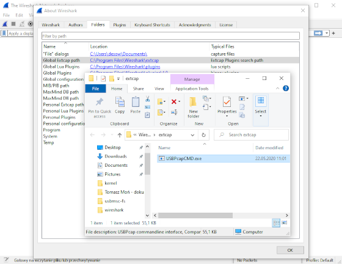
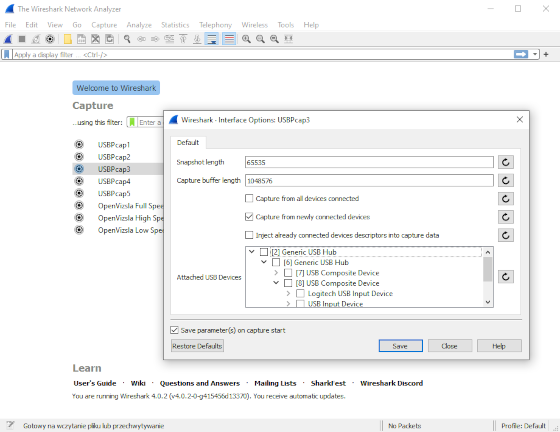
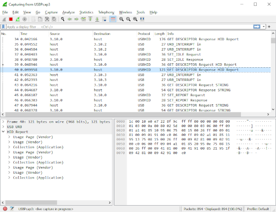
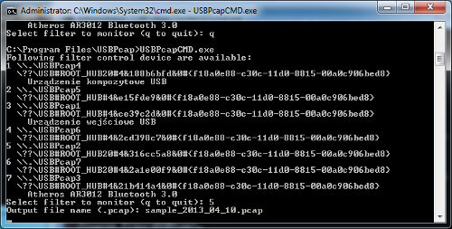
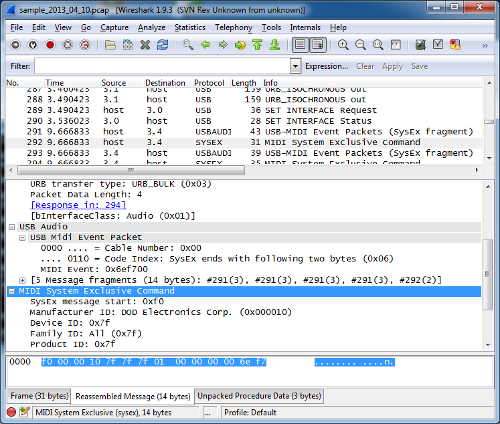
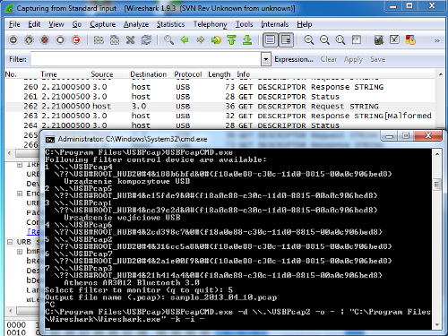

Use USBPcap as Wireshark extcap
-------------------------------

Starting with USBPcap 1.2.0.0 it is recommended to use USBPcapCMD as Wireshark extcap. In order for USBPcap to appear in Wireshark interfaces list, USBPcapCMD has to be copied to either global or personal extcap directory. The extcap directory can be found by starting Wireshark, clicking on Help->About Wireshark and navigating to Folders tab.

 [](tour/extcap_install.png "USBPcapCMD.exe copied to Global Extcap path.")

Once USBPcapCMD is copied to Wireshark extcap directory, USBPcap interfaces will show up in Wireshark. To configure capture session, click on the gearbox symbol next to one of available USBPcap interfaces.

 [](tour/extcap_options.png "USBPcap3 capture options. Capture from newly connected devices option allows to capture most of device enumeration.")

Attached USB Devices in USBPcap options can be used to determine the Root Hub to which the device is connected to. It is recommended to configure USBPcap to capture from newly connected devices. Capture can be started by double clicking on USBPcap interface.

 [](tour/extcap_live_capture.png "USBPcap3 live capture in progress. Wireshark shows captured HID Report descriptor.")

USB Packet capture for Windows Tour (obsolete)
----------------------------------------------

This short tour assumes you have installed the latest version of USBPcap and Wireshark 1.10.0rc1 (or newer) and rebooted your system. Each of the steps contains short description of what should happen and in some cases gives tips for troubleshooting.

If you feel the information provided there is not complete (it doesn't cover your case), please describe your problem on the [USBPcap mailing list](https://groups.google.com/group/usbpcap).

### Step 1 - identify the Root Hub you want to monitor

The first step is to connect the device you want to sniff the traffic and identify the Root Hub this device is connected to. In order to do so, launch the USBPcapCMD.exe that is stored in the installation directory. You should be presented with something similiar to the picture below.

 [](tour/step1.png "USBPcapCMD.exe showing list of available devices.")

#### Troubleshooting step 1

If for any reason you can't see the list of connected devices make sure you have the USBPcap driver installed and you **have restarted your computer** after the installation.

### Step 2 - start the capture

So now you know which of the Root Hubs available in your system you want to monitor. Please disconnect the device from your computer - this will allow USBPcap to capture the USB descriptors needed for analysis in Wireshark. Now you can run the USBPcapCMD.exe again and enter your desired output file name. (A careful reader will notice that they can skip the restart part: all that required to get the descriptors in the capture file is to reconnect your device after capture has started.).

We will be capturing the Root Hub that showed the two Hubs connected to it and an composite USB device (it is actually DigiTech RP250).

 [](tour/step2.png "USBPcapCMD.exe during capture.")

Now it is time to use the device in order to get packets captured. In this example I have simply started the X-Edit software that controls the DigiTech RP250.

### Step 3 - analyse the data

After you're done collecting data, press Ctrl+C and start Wireshark. Once started, open the pcap file you have created in Step 2. You should see the packets allongside with their description. The sample capture is available at the Google code: [sample\_2013\_04\_10.pcap](https://usbpcap.googlecode.com/files/usbpcap_sample_v2.pcap)

 [](tour/step3.png "Wireshark dissecting USBPcap trace.")

### Step 4 - live capture

If you didn't like that in steps 2 and 3 you had to finish capturing before having a chance to look at the data, you can also do a live capture. In order to do so, you must have running the cmd.exe with elevated privileges (as Administrator). Then enter the following command:

```
USBPcapCMD.exe -d \\.\USBPcap2 -o - | "C:\Program Files\Wireshark\Wireshark.exe" -k -i -
```

This should result in live capture from standard input in Wireshark as shown below.

 [](tour/stdin_capture.png "Wireshark capturing from standard input.")

### Step 5 - Contribute to the project :-)

Once you know how to use USBPcap you might want it to work better. There are numerous ways to help, for example:

*   Improving project website
*   Improving the documentation
*   Improving the filter driver
*   Improving the sample application
*   Improving installation process
*   Creating project artwork (icon, website banner, etc.)
*   Integrating the project more closely with Wireshark (dumpcap)
*   Donating money

If you can help please check the menu on the right for links for github page, donation fund and contact information.
